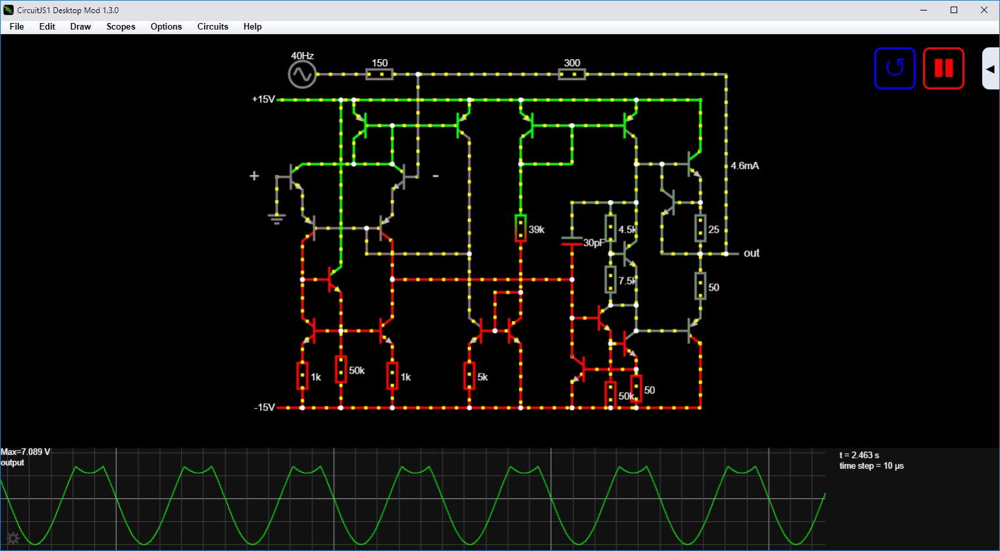

# CircuitJS1 Desktop Mod

**Circuit Simulator is renamed CircuitJS1 Desktop Mod**



The source code for offline version of the **Circuit Simulator** with minor modifications based on [modified NW.js](https://github.com/SEVA77/nw.js_mod). It was originally written by Paul Falstad as a Java Applet. It was adapted by Iain Sharp to run in the browser using GWT. The program was modified and compiled to offline version for Windows (x32, x64), Linux (x32, x64) and MacOS (x64, arm64) by Usevalad Khatkevich.

This program is distributed by me as a program for education. It is not recommended to use the program for modeling real circuits, since many components in the program are idealized.

The program supports the following languages: English, Russian, Danish, German, Polish, Spanish, French, Italian, Portuguese, Czech, Norwegian, Chinese, Japanese.

For a web version of the application see:

Paul's Page: https://www.falstad.com/circuit/ \
Source code: https://github.com/pfalstad/circuitjs1

Iain's Page: https://lushprojects.com/circuitjs/ \
Source code: https://github.com/sharpie7/circuitjs1

## Downloads:

You can download this program for Windows (x32, x64), Linux (x32, x64) and Mac OS X (x64, arm64):
- [Latest release](https://github.com/SEVA77/circuitjs1/releases/latest)
- [All Releases](https://github.com/SEVA77/circuitjs1/releases)

> If you have problems with this application, you can try to use [this offline application of the main developer](http://www.falstad.com/circuit/offline/) based on Electron.

## Building the program

The tools you will need to build the project are:

* JDK 8+
* Maven 3+
* Node.js with npm

Install the dependencies in the local `node_modules` folder:
```
npm install
```

For full build for all platforms without rebuilding GWT app run:
```
npm run build
```

For full build with rebuilding GWT app run:
```
npm run full
```

*Output folder:* `./out/`

Also you can build only the GWT application:
```
npm run buildgwt
```

and run it in NW.js SDK version:
```
npm start
```

*Output folder:* `./target/site/`

## Development

Various build options, checker and devmod are available in the development menu:

```
npm run dev
```

***Separate commands:***

Check the build steps:
```
npm run check
```

Run devmode:
```
npm run devmode
```

Devmode works directly in the `war` directory separate from the `target/site` directory.

## License

This program is free software; you can redistribute it and/or modify it under the terms of the GNU General Public License as published by the Free Software Foundation; either version 2 of the License, or (at your option) any later version.

This program is distributed in the hope that it will be useful, but WITHOUT ANY WARRANTY; without even the implied warranty of MERCHANTABILITY or FITNESS FOR A PARTICULAR PURPOSE. See the GNU General Public License for more details.

You should have received a copy of the GNU General Public License along with this program; if not, write to the Free Software Foundation, Inc., 51 Franklin Street, Fifth Floor, Boston, MA 02110-1301, USA.

© Usevalad Khatkevich 2024

## Credits

* [Paul Falstad](https://github.com/pfalstad) - Creator
* [Iain Sharp](https://github.com/sharpie7) - JavaScript conversion, so there are more opportunities for the development of this application.
* [Brian Gordon](https://github.com/briangordon) - Mavenized version of circuitjs1
